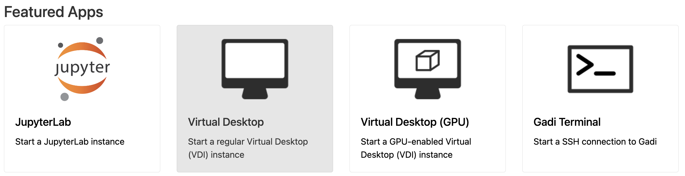
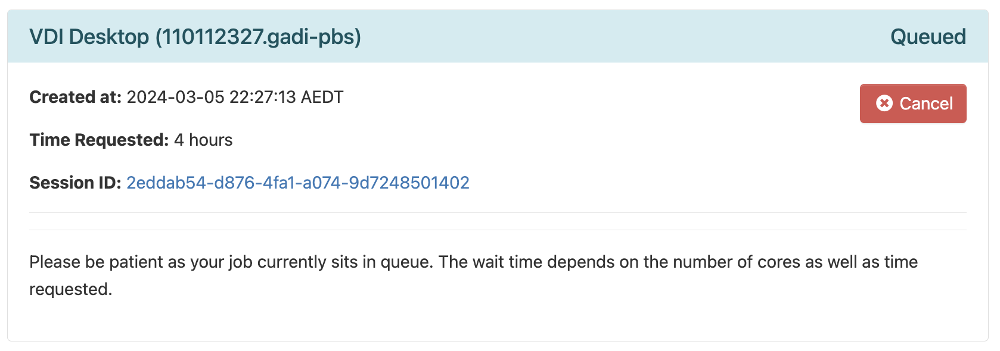
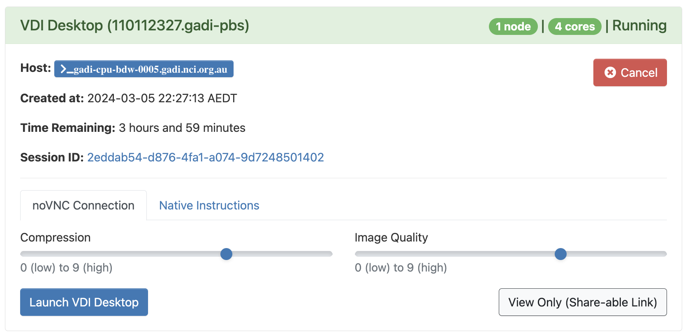
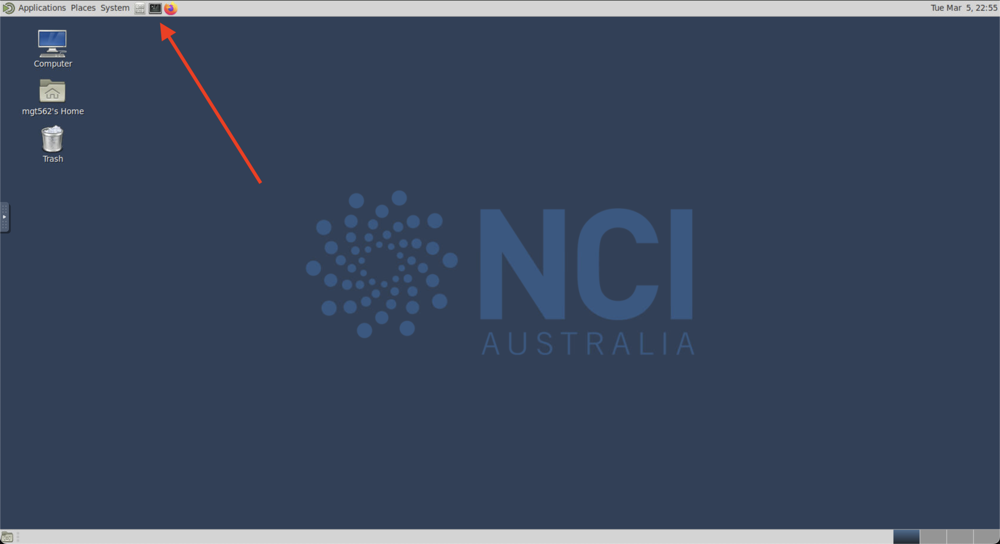

# ACCESS-NRI CMIP7-Hackathon ARE Virtual Desktop (VDI) setup guide
<p>Quick-start guide to setting up a virtual desktop (VDI) session using the Australian Research Environment (ARE) to run the ACCESS-NRI CMIP7-Hackathon exercises.</p>

## Quick-links to sections
- [0. Pre-Workshop preparation](https://github.com/ACCESS-NRI/CMIP7-Hackathon/blob/main/docs/ARE_VDI_setup_guide.md#0-pre-workshop-preparation)
- [1. Open ARE/VDI on Gadi](https://github.com/ACCESS-NRI/CMIP7-Hackathon/blob/main/docs/ARE_VDI_setup_guide.md#1-open-are-on-gadi)
- [2. Start VDI App](https://github.com/ACCESS-NRI/CMIP7-Hackathon/blob/main/docs/ARE_VDI_setup_guide.md#2-start-vdi-app)
- [3. Configure VDI session](https://github.com/ACCESS-NRI/CMIP7-Hackathon/blob/main/docs/ARE_VDI_setup_guide.md#3-configure-vdi-session)
- [4. Launch VDI session](https://github.com/ACCESS-NRI/CMIP7-Hackathon/blob/main/docs/ARE_VDI_setup_guide.md#4-launch-vdi-session)
- [5. Setup Hackathon ESMValTool environment and run recipes](https://github.com/ACCESS-NRI/CMIP7-Hackathon/blob/main/docs/ARE_VDI_setup_guide.md#5-setup-hackathon-esmvaltool-environment-and-run-recipes)

## 0. Pre-workshop preparation

- *0.1* In order to get the most out of the Hackathon, you will require a NCI account. If you do not yet have a NCI account, you can sign up on the [MyNCI website](https://my.nci.org.au).
- *0.2* To run the exercises, access to specific projects on Gadi is required. To help things run as smoothly as possible on the day, please log in to the [MyNCI website](https://my.nci.org.au) and join the following projects:
`nf33`, `xp65`, `fs38`, `oi10`, `al33`, `rr3`, `rt52`, `zz93` and `ct11` **prior** to attending the Hackathon. Please note it can take 1-2 days to receive membership approvals.

[\[Back to top\]](https://github.com/ACCESS-NRI/CMIP7-Hackathon/blob/main/docs/ARE_VDI_setup_guide.md#access-nri-cmip7-hackathon-are-virtual-desktop-vdi-setup-guide)

## 1. Open ARE/VDI on Gadi
Go to the [Australian Research Environment](https://are-auth.nci.org.au/) website and login with your **NCI username and password**. If you don't have an NCI account, you can sign up for one at the [MyNCI website](https://my.nci.org.au).

<p align="center"></p>

[\[Back to top\]](https://github.com/ACCESS-NRI/CMIP7-Hackathon/blob/main/docs/ARE_VDI_setup_guide.md#access-nri-cmip7-hackathon-are-virtual-desktop-vdi-setup-guide)

## 2. Start VDI App
Click on `Virtual Desktop` under *Featured Apps* to configure a new VDI instance. This option is also available under the *All Apps* section at the bottom of the page and the *Interactive Apps* dropdown located in the top menu.

<p align="center"></p>

[\[Back to top\]](https://github.com/ACCESS-NRI/CMIP7-Hackathon/blob/main/docs/ARE_VDI_setup_guide.md#access-nri-cmip7-hackathon-are-virtual-desktop-vdi-setup-guide)

## 3. Configure VDI session
You will now be presented with the main JupyterLab instance configuration form. Please complete **only** the fields below - leave all other fields blank or to their default values.

- *3.1* **Walltime**: The number of hours the VDI instance will run. For the hackathon, please insert a walltime of `4` hours.

<p align="center"></p>

- *3.2* **Compute Size**: Select `Medium (4 cpus, 18G mem)` from the dropdown menu.

<p align="center"></p>

- *3.3* **Project**: Please enter `nf33`. This will allocate SU usage to the hackathon project.

<p align="center"></p>

- *3.4* **Storage**: This is the list of project data storage locations required to complete the hackathon exercises. In ARE, storage locations need to be explicitly defined to access these data from within a VDI instance. Please copy and paste the following string listing into the storage input field:
```
scratch/nf33+gdata/nf33+gdata/xp65+gdata/fs38+gdata/oi10+gdata/al33+gdata/rr3+gdata/rt52+gdata/zz93+gdata/ct11
```

<p align="center"></p>

- *3.5* Click `Launch` to start your JupyterLab instance.


<p align="center"></p>

[\[Back to top\]](https://github.com/ACCESS-NRI/CMIP7-Hackathon/blob/main/docs/ARE_VDI_setup_guide.md#access-nri-cmip7-hackathon-are-virtual-desktop-vdi-setup-guide)

## 4. Launch VDI session
Once you have clicked `Launch` the browser will redirect to the 'interactive sessions' page where you will see your VDI instance details and current status which will initially look something like this:

<p align="center"></p>

Once the VDI instance has started (this usually takes around 30 seconds) and this status window should update and look something like the following, reporting that the instance has started and the time remaining. More detailed information on the instance can be accessed by clicking the `Session ID` link.

Additionally there are extra streaming performance related controls here for both `Compression` and `Image Quality`. Generally the default settings here work fine, but if you are having trouble you can adjust these parameters.

<p align="center"></p>

Click `Launch VDI Desktop`. This opens the VDI instance a new browser window where you can navigate to the location of the cloned tutorial files.

Depending on which browser you are using, a prompt can appear in the browser at VDI startup stating that ARE is requesting access to your computer clipboard. This is optional, but allowing this access can make transferring copied text and files between your computer and the VDI instance much easier!

[\[Back to top\]](https://github.com/ACCESS-NRI/CMIP7-Hackathon/blob/main/docs/ARE_VDI_setup_guide.md#access-nri-cmip7-hackathon-are-virtual-desktop-vdi-setup-guide)

## 5. Setup Hackathon ESMValTool environment and run recipes
To finalise the system setup, we must run the hackathon setup scripts. These load the required ESMValTool-workflow dependencies, verify that your NCI account has access to the required projects on Gadi and that their respective storage locations are mounted, clones the [CMIP7-Hackathon Github repository](https://github.com/ACCESS-NRI/CMIP7-Hackathon), and automatically runs each of the hackathon ESMValTool recipes as PBS jobs on Gadi.

To do this within VDI, from the top menu we must first open `Terminal` by clicking on the small computer screen icon shown in red below:

<p align="center"></p>

Enter the following two commands (one after the other). The first command loads some necessary dependencies needed to run ESMValTool, and the second command loads the required [ACCESS-NRI ESMValTool-workflow](https://github.com/ACCESS-NRI/ESMValTool-workflow) module.
```
module use /g/data/xp65/public/modules
```
```
module load esmvaltool
```

then finally:

```
check_hackathon
```
You will see a range of checks and processes print to the screen, which may take up to 1 minute to complete. Once you see the "YOU ARE ALL SET!!!" message, everything is setup and ready to go.

[\[Back to top\]](https://github.com/ACCESS-NRI/CMIP7-Hackathon/blob/main/docs/ARE_VDI_setup_guide.md#access-nri-cmip7-hackathon-are-virtual-desktop-vdi-setup-guide)
